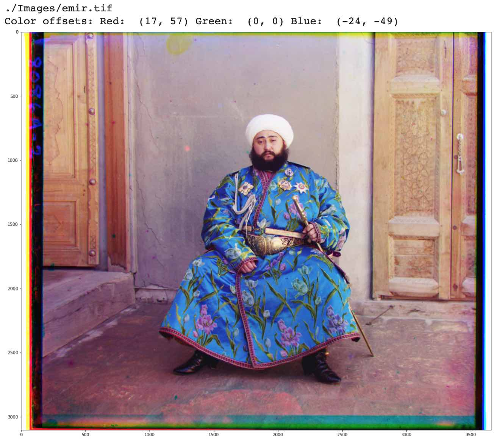
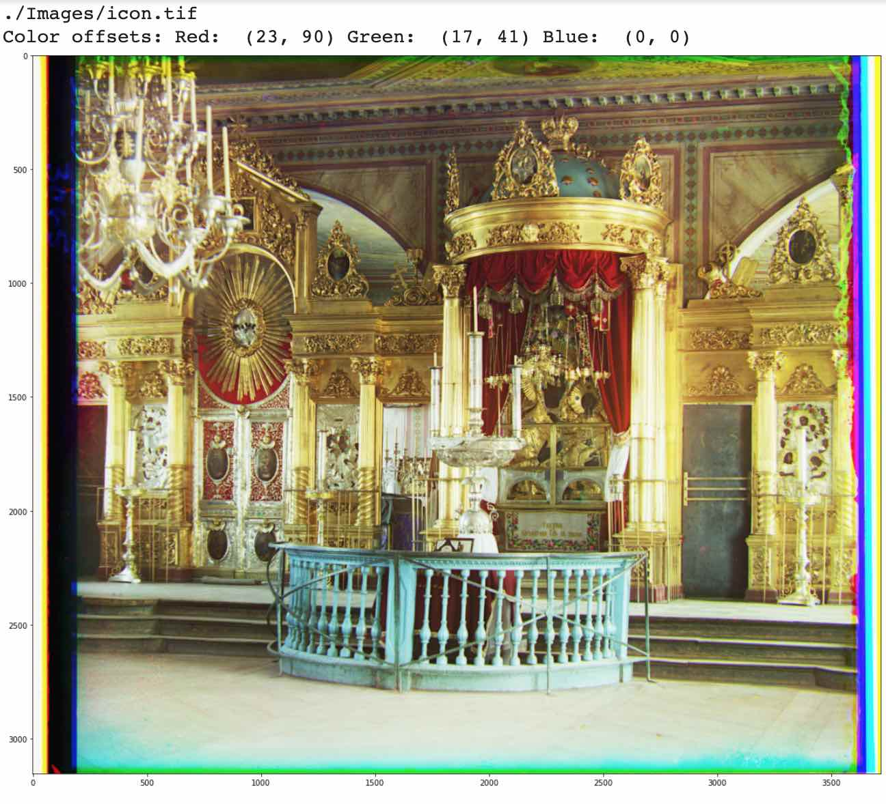
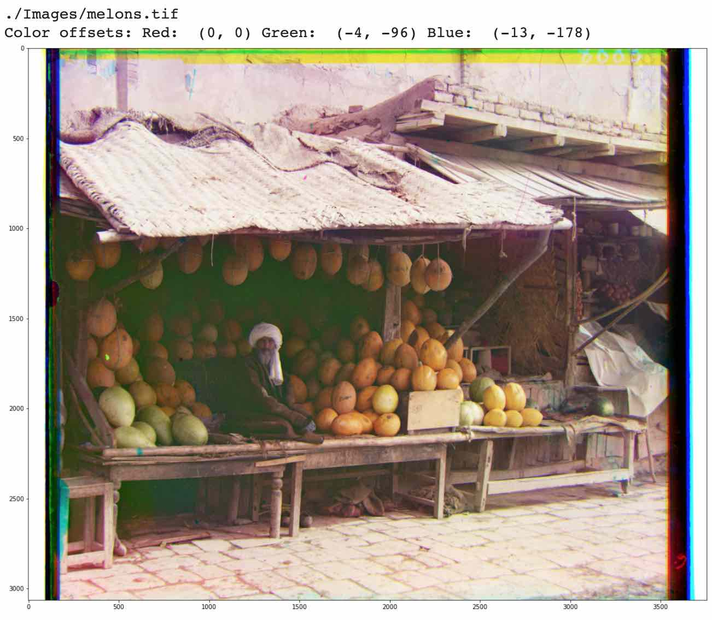
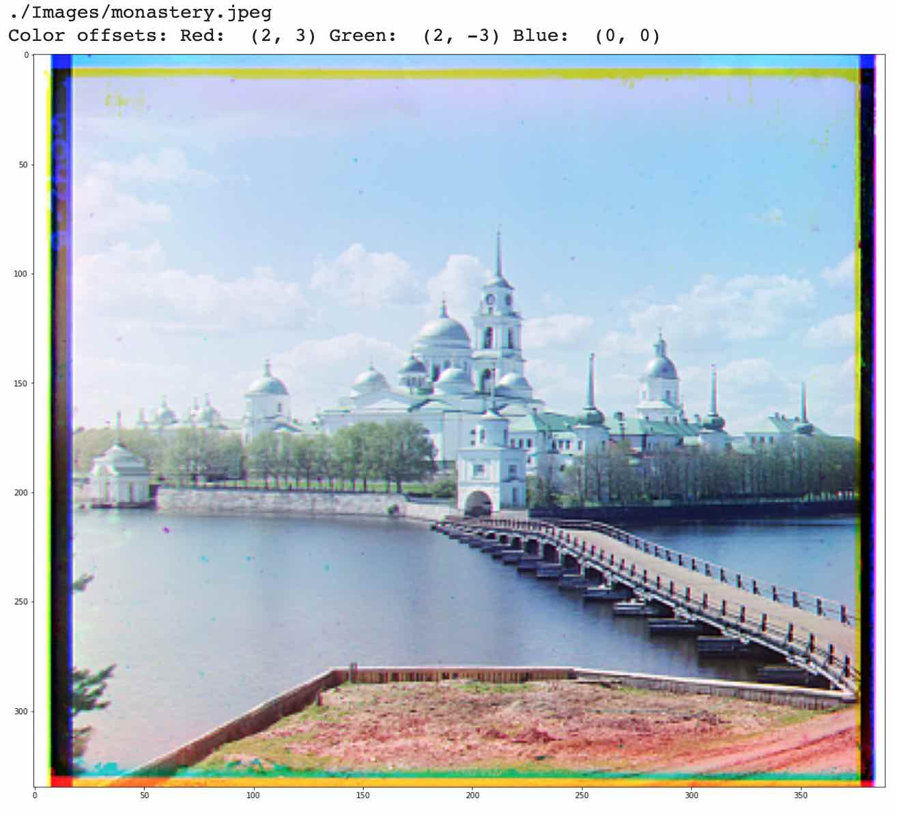
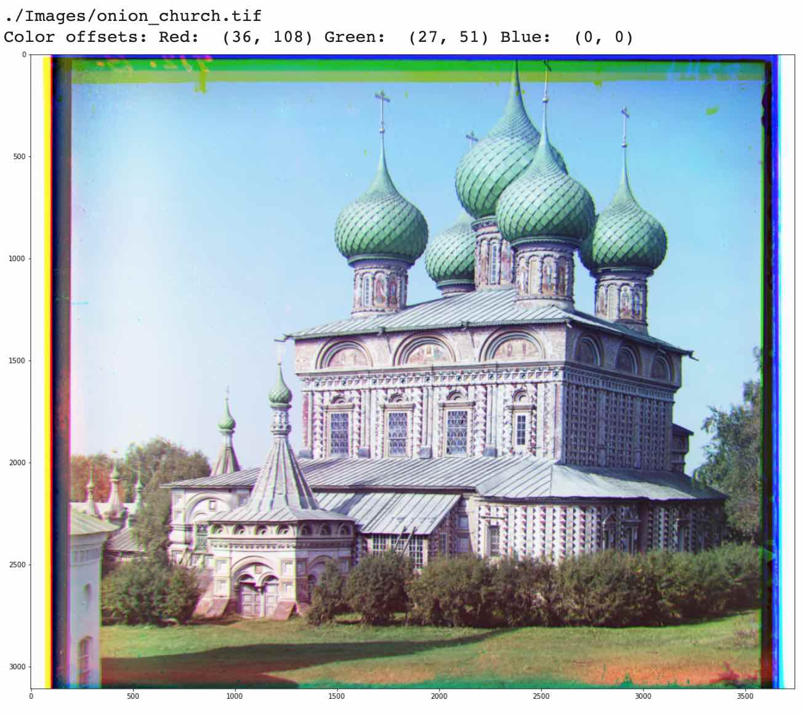
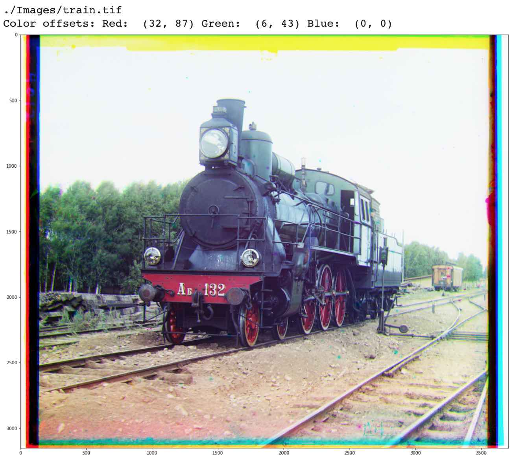
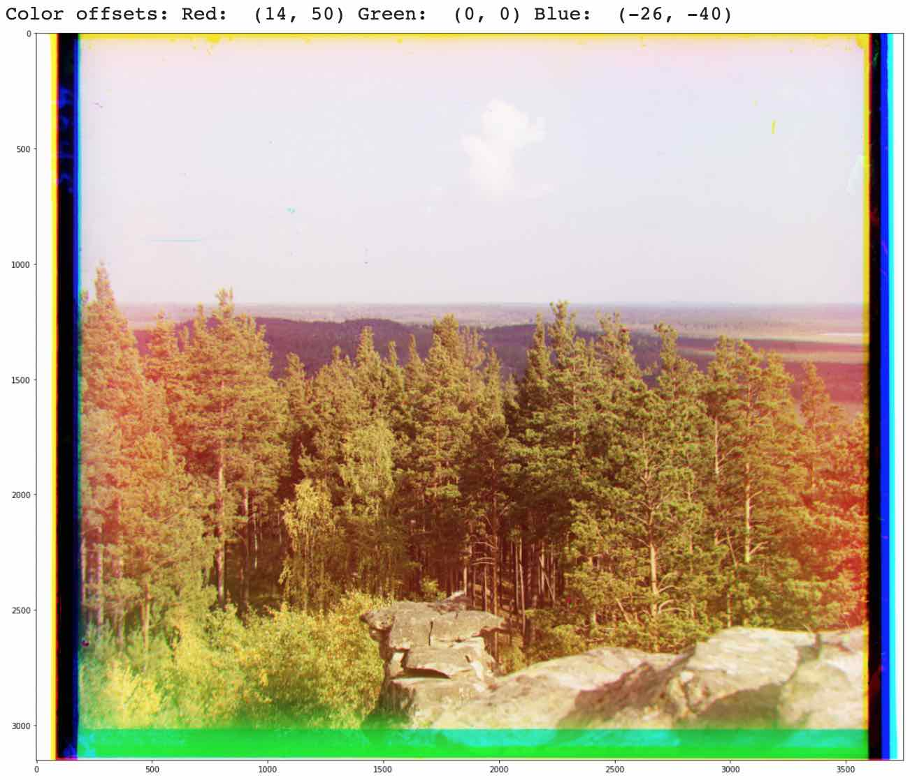
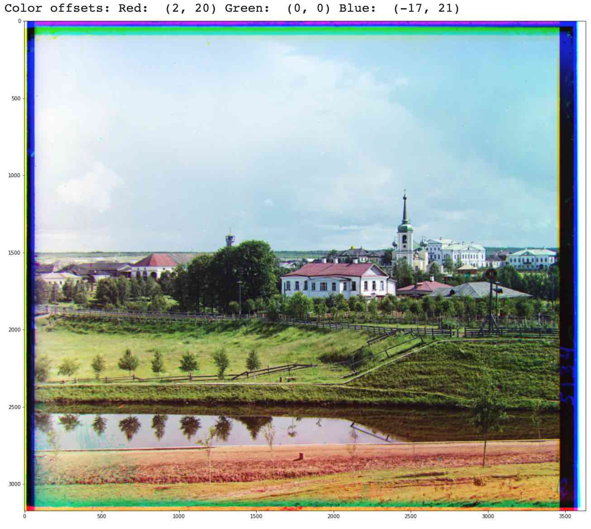
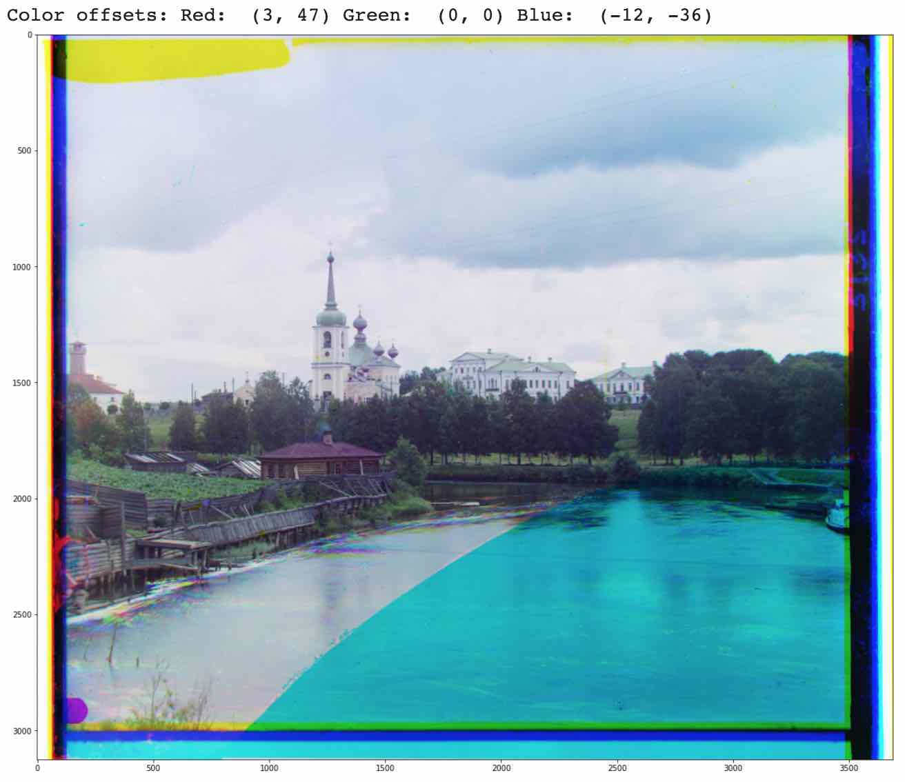
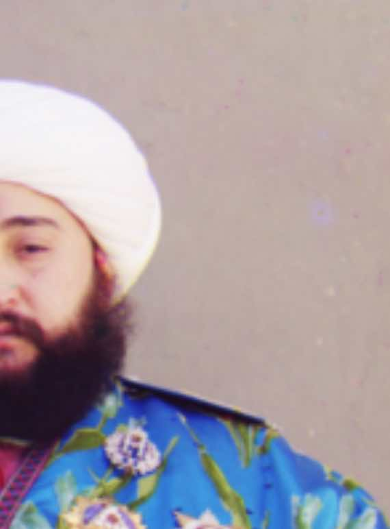

# Project 1

In this project, we are working with negatives created by Sergei Mikhailovich Prokudin-Gorskii, a man who received the Tzar's backing to capture color photos of the Russian Empire. To do this, he shot photographs with red, green, and blue filters... plates which reside with the Library of Congress, where we can reconstruct the photos he took with color, just as he imagined it.

We want to take these photos and reproduce them in color by aligning the 3 separate images, printing the resulting image from the aligned color channels. In order to decide which offset of the plates will work the best, we need to implement a variety of search methods.

**Exhaustive Search**
We can first brute-force the problem by taking one plate as a base, taking each of the two remaining plates, and individually searching every configuration within some range to see where it best lines up with the base plate.

**Pyramid Search**
Since it can be computationally intensive to use exhaustive search for very high resolution images, we need a better way. Instead of trying to line up the full resolution images right away, pyramid search exhaustively searches lower resolution versions of the image first to get an estimate of where our 2 plates line up with our chosen base plate. We then slowly scale this up to the higher resolution version of the image, searching in the neighborhood of our previous estimate, refining the estimate at higher resolutions as we go along, until we finish the final exhaustive search at the highest resolution in the neighborhood of our lower resolution estimate.
The reason that this works so well is that ultimately, on the top level we will be searching using the exhaustive search to get the correct answer (assuming our lower resolution estimates are at least somewhat accurate), but by searching wider areas at lower resolutions (where things are computationally less expensive) we can estimate where the final answer will be and search a smaller area at higher resolutions.

**Alignment Scores**
In order to decide where the best fit is, we need to have some metric for how aligned the two images are. The basic way is to use a sum of squared differences between all elements in the overlapping color plates, with the intuition that generally, each color channel tends to grow lighter or darker together, so the most aligned image will have pixel values that are somewhat close together. This will work well enough until we start having to deal with very saturated colors, which will force us to choose our base color carefully, lest we chose the plate corresponding to the saturated color as our base, in which case the other two plates will have great difficulty matching to the base plate.

**Implementational Notes**
Since the objective was for us to implement these from scratch as much as possible, instead of using padded convolutions to search through all matchings at once, I double for looped over our search area to do the brute forcing.
Additionally, I chose to implement scores, so that when most aligned, the score will be **maximized** instead of minimized. For the sum of squared differences score, this translate to simply negating the scores, so that the one with minimal difference between pixels will be closest to zero, and the largest (since no score will be negative before we negate it).
For my ssd score, due to the fact that I chose not to wrap or anything, I chose to normalize the score to account for the fact that larger offsets would have smaller overlaps.

**Results**

**Other Images in the Collection**
Here are some other images from the collection.

**Bells and Whistles**

Many of these images had to have their base color selected in order to get best allignment. The reason for this is that if one plate has a very saturated color, then that one plate will have a strongly defined color in one region, while the other two plates may not have that much defined color in that region, breaking the assumption that all colors tend to have similar values in all regions of the image. Since this was the fundamental assumption in the ssd scoring, when our base is saturated, we can see this break. In the picture with the emir, blue and red are highly saturated with the robe having saturated blues and reds. Below are two photos: one with blue base and another with red base. Green is the only plate that aligns well in this photo.

Blue Base:

Red Base (There is some yellow smearing that is visible near the edge of his head):

Since this assumption about the lack of color saturation in images is clearly being violated, we need to come up with a better method. The simple answer is that we should first process the image by absolute value of color gradients. Since the color isn't 100% saturated, in all color channels there is some boundary at the edge of his robe, around his head, around the depictions on his robe, etc, we should try and line up these edges if anything. So I implemented an image processing step that takes our r, g, b images and processes them, adding the absolute value of x, y, and xy Sobel filter edges, then rescaling so that we clip between 0 and a few standard deviations of the mean. The output image aligns well on every image that I have tested it on so far, and works for all settings of the base color.

